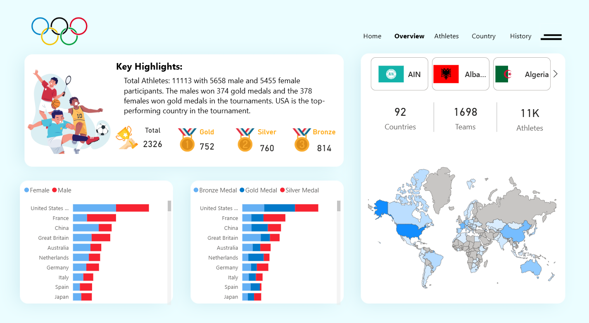
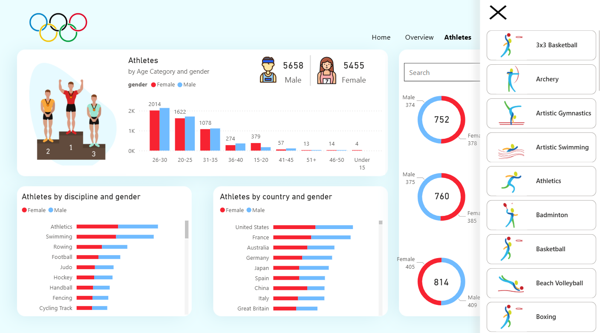
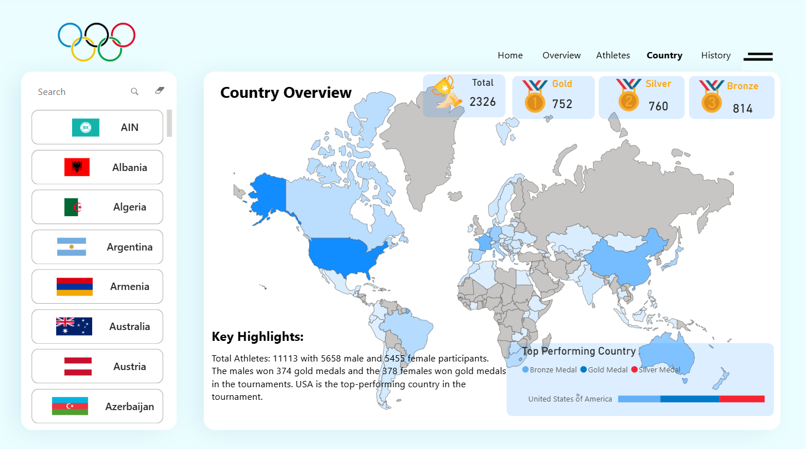
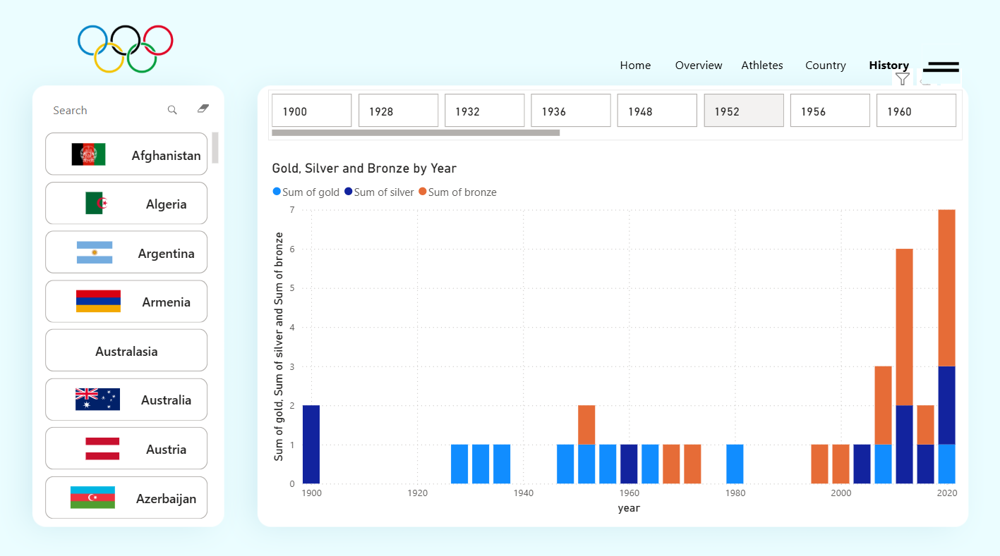

# 🏅 Olympics 2024 Dashboard — Power BI Project

**Created by Manish**

This interactive Power BI dashboard visualizes the performance of countries and athletes in the 2024 Paris Olympics. It provides insights into medal tallies, gender-based distributions, country-wise participation, and historical performance.

---

## 📊 Key Features

- 🌍 Medal distribution across 92 countries
- 👨‍🦰👩‍🦰 Gender-based medal comparison (Male vs Female)
- 🧑‍🤝‍🧑 Athletes by age group, discipline, and gender
- 🗺️ Interactive shape map highlighting top-performing countries
- 🕰️ Historical medal trends by year
- 🔎 Search filters by country and discipline

---

## 📌 Dashboard Pages

1. **Home** – Navigation page with Olympic branding
2. **Overview** – Summary stats with medal and country-level insights
3. **Athletes** – Breakdown of participants by gender, age, and discipline
4. **Country** – Detailed map view and country-wise medal stats
5. **History** – Timeline of medal trends from 1900–2024

---

## 🖼️ Dashboard Preview

### Overview Page  

### Athletes Page  

### Country Page  

### History Page  

---

## 🚀 Tech Stack

- **Power BI Desktop**
- Custom visuals and filters
- Shape map with custom TopoJSON 
---

## 📂 How to Use

1. Clone the repo or download the `.pbix` file.
2. Open in **Power BI Desktop**.
3. Interact with slicers, search bars, and maps for insights.

---

⭐ *If you like this project, feel free to give it a star and share your feedback!*
